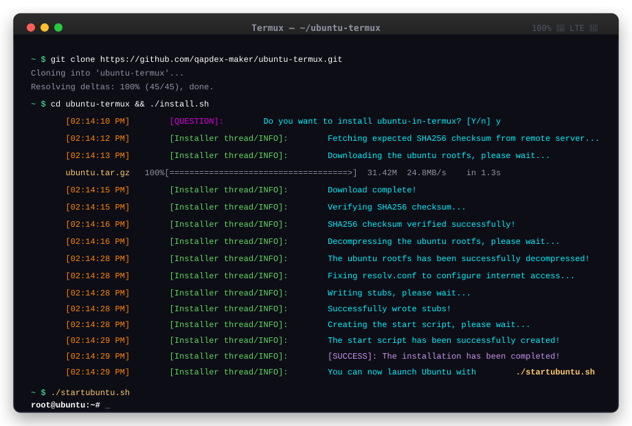

[](https://cdimage.ubuntu.com/ubuntu-base/releases/24.04.4/release/)
[](https://www.gnu.org/software/bash/)
[](https://termux.dev/)
[](#)

An exceptionally fast, highly optimized, secure, and user-friendly installer script to run a full **Ubuntu 24.04.4 LTS (Noble Numbat)** environment inside **Termux** on Android devices. No root permissions required.

---

## 📸 Installation & Launch Preview

Below is a simulated interactive terminal showcase of the installation process and successful launch:



---

## ✨ Features & Advantages

- ⚡ **Native Decompression Pipeline**: Bypasses PRoot system call interception overhead, reducing rootfs extraction times by up to **80%**.
- 📥 **Resilient Archive Caching**: Intelligently identifies, resumes, and validates existing download caches using standard `wget -c` and secure local SHA256 checksums.
- 🔒 **Sentinel Hardened Security**: Enforces safe default umask permissions, protects against format string vulnerabilities in terminal logging, and avoids insecure on-disk temporary metadata files.
- 🎯 **Seamless User Experience**: Implements intuitive interactive defaults (e.g., hitting `[Enter]` on `[Y/n]` defaults to "Yes") and provides real-time, non-blocking download feedback.
- ⚙️ **Automatic Network Resolution**: Presets standard public DNS name servers inside the guest environment's `/etc/resolv.conf`.
- 📁 **Modular Bind-Mounts**: Supports automated directory binding (e.g., `/sdcard`, `/storage`, `/mnt`) for seamless host-guest file sharing.

---

## 🚀 Quick Start

### 1. Prerequisites
Open Termux and ensure your packages are up-to-date, then install the required utilities:
```bash
pkg update && pkg upgrade -y
pkg install proot wget git -y
```

### 2. Run the Installer
Clone this repository and run the installation script:
```bash
git clone https://github.com/qapdex-maker/ubuntu-termux.git
cd ubuntu-termux
chmod +x install.sh
./install.sh
```
*Alternatively, if you want to bypass the interactive prompt and install immediately, run with the `-y` flag:*
```bash
./install.sh -y
```

### 3. Launch Ubuntu
Once the installation completes, start your Ubuntu session by running:
```bash
./startubuntu.sh
```
You will be logged in immediately as the `root` user!

---

## 🛠️ Advanced Usage & Bind Mounts

### Executing Direct Inline Commands
You can pass commands directly to the Ubuntu environment from your host Termux terminal:
```bash
./startubuntu.sh "apt update && apt install python3 -y"
```

### Managing Custom Mounts
The script automatically mounts a variety of directories from the Android OS (`/sdcard`, `/storage`, `/mnt`, etc.).

If you want to customize bind mounts, you can add shell scripts to the `ubuntu-binds/` directory. Any file placed inside `ubuntu-binds/` will be evaluated by the start script. For example, to bind an additional directory:
```bash
echo "command+=\" -b /path/to/android/dir:/root/dir\"" > ubuntu-binds/my_custom_mount
```

---

## 🧠 Technical Architecture & Design Decisions

### 1. Performance-Tuned Extraction Pipeline (Decompression Pipelining)
In non-root Linux emulation on Android, `proot` utilizes `ptrace` to intercept and translate system calls. This results in heavy performance penalties for CPU-intensive commands.

In classic installer scripts, extracting the rootfs archive inside `proot` via `tar -zxf` is incredibly slow. To bypass this bottleneck, `ubuntu-termux` splits decompression from the `proot` wrapper:
1. Decompression is performed natively outside of PRoot using `gzip -dc`.
2. The decompressed tar stream is piped directly into `proot --link2symlink tar -xf -`.

This eliminates ptrace interception overhead during the CPU-heavy decompression phase, speeding up rootfs installation significantly.

### 2. Resilient Downloads & Single-Fetch Metadata Caching
To save mobile bandwidth and accelerate setup under spotty cell networks:
- **One-Time Checksum Fetch**: The installer fetches the official remote `SHA256SUMS` file exactly once, extracts the target checksum, and caches it in-memory.
- **Archive Caching**: Before downloading, the script verifies any existing `ubuntu.tar.gz` against the cached checksum. If valid, downloading is skipped entirely.
- **Resumable Downloads (`wget -c`)**: If an incomplete download exists, the script attempts to resume it (`wget -c`). If validation fails, it safely falls back to a fresh download. This offers robust protection against cellular network drops.

### 3. Hardened Security Design (Sentinel Principles)
- **Secure Stream-Based Verification**: Typical installers write remote checksum files to temporary disk files, creating potential local race conditions or symlink attacks. Our script streams the remote metadata directly in-memory over Unix pipelines (`wget -q -O- | grep | ... | sha256sum -c -`) without creating predictable, vulnerable temporary files.
- **Default Permissions (`umask 022`)**: The script enforces a secure default umask of `022` at initialization. This ensures all newly created files (like `startubuntu.sh` and guest configuration files) are readable but never writable by other local users on a multi-user Android environment.
- **Format String Protection**: To safeguard logging output from format-string exploit vectors, all dynamic variables and user inputs are passed as explicit arguments using the `%s` format specifier in `printf` rather than evaluated directly inside format string literals:
  ```bash
  printf "\x1b[38;5;214m[%s]\e[0m \x1b[38;5;203m[ERROR]:\e[0m \x1b[38;5;87m Invalid option: '%s'.\n" "${time1}" "$1"
  ```

### 4. Human-First UX Engineering (Palette Principles)
- **Smart CLI Inputs**: In CLI tools, presenting options like `[Y/n]` implies that hitting "Enter" (submitting empty input) will select the capitalized option ("Yes"). The installer explicitly parses empty inputs as "Yes", while accepting standard variations (`y`, `Y`, `yes`, `Yes`, `YES`).
- **Visual Progress Feedback**: Long downloads on mobile can appear frozen if output is completely suppressed. We configure `wget` with `-q --show-progress` to provide a clean, visual download speed, progress bar, and ETA while keeping terminal output uncluttered.

---

## ❔ Troubleshooting & FAQs

### Q: I get `proot is missing!` or `wget is missing!` errors.
You need to install them in Termux first before running the installation:
```bash
pkg install proot wget -y
```

### Q: I get `FATAL: kernel too old` when launching `./startubuntu.sh`.
Some older Android devices run on ancient kernel versions that are incompatible with modern Ubuntu system calls. To bypass this, edit `./startubuntu.sh` and uncomment the kernel simulation flag:
```bash
# Before:
#command+=" -k 4.14.81"

# After:
command+=" -k 4.14.81"
```

### Q: Why can't I access the internet inside Ubuntu?
If you run into DNS errors (e.g., `Temporary failure in name resolution`), your Android system might be blocking or overriding standard DNS setups. You can manually edit `/etc/resolv.conf` inside Ubuntu to point to your preferred DNS server:
```bash
nameserver 8.8.8.8
nameserver 1.1.1.1
```

---

## 🧪 Development & Mock Testing
To test installation behaviors, cache hits, checksum logic, and CLI prompt behaviors safely on non-Android systems (such as a local Linux machine/CI environment), a mock environment harness is provided:

Run the mock suite:
```bash
./run_mock_test.sh
```
This sets up a containerized mock directory structure, emulates Termux binary tools (such as `dpkg --print-architecture`, `termux-fix-shebang`, and `proot`), runs test cases for clean installations, and verifies that the local cache validation triggers correctly.

---

## 📄 License
This project is licensed under the MIT License. See the [LICENSE](LICENSE) file for details.
